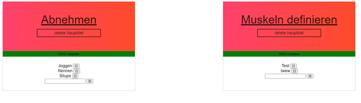
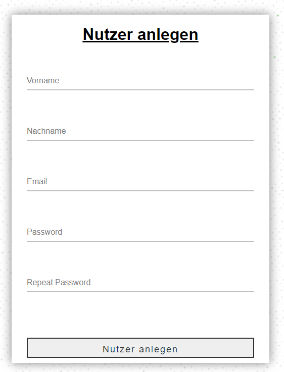
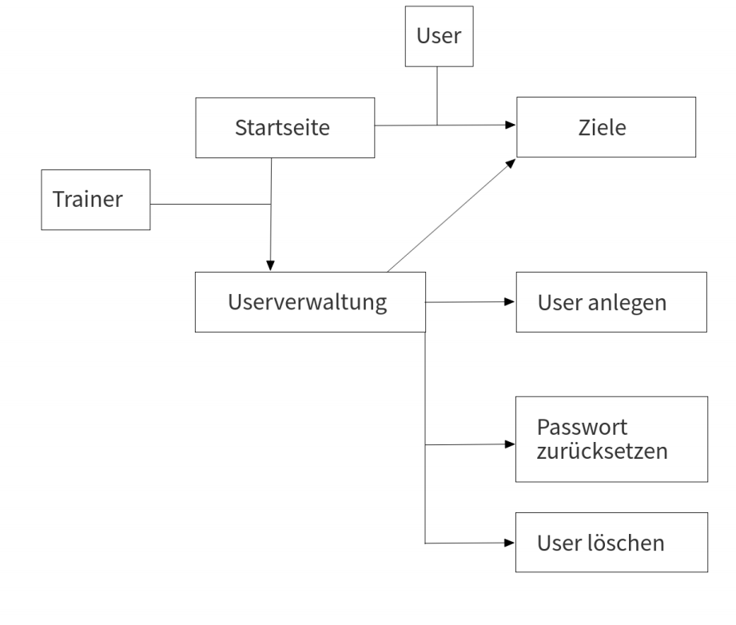
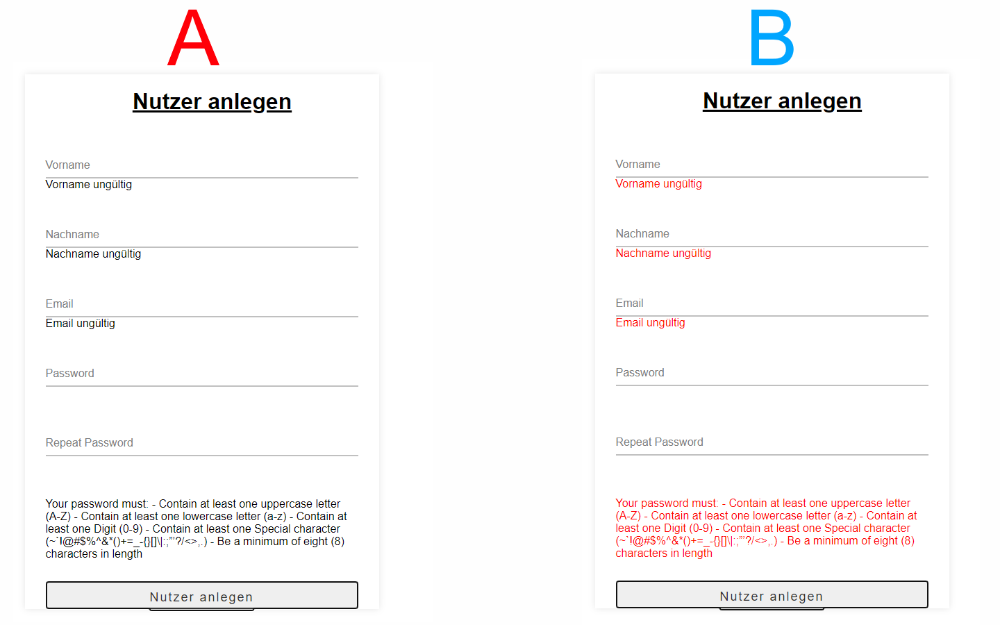
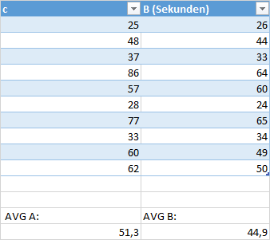
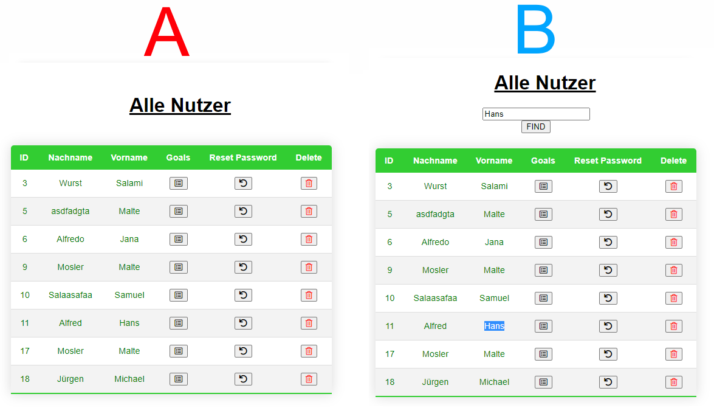

# Fitnesso 1.0

Kann removed werden wenn in Readme aufgenommen(todo):

##### Entwurf eines Prototypen (Prototyp + Informationsarchitektur) aus den Personas und den User Storys:

    ./Kommentare/Entwurf

##### Kommentierung der Prototypen mit Gestaltgesetzen und Infos zu menschlichen Wahrnehmung:

    ./Kommentare/Kommentierung-Prototypen

##### Kommentierung der Umsetzung des Prototypen mittels Entwurfsmuster:

    ./Kommentare/Kommentierung-Umsetzung

## Dokumentation:

**Table of Contents**

- [Entwurf eines Prototypen (Prototyp + Informationsarchitektur) aus den Personas und den User Storys](#Prototyp)
- [Kommentierung der Prototypen mit Gestaltgesetzen und Infos zu menschlichen Wahrnehmung](#Gestaltgesetze)
- [Kommentierung der Umsetzung des Prototypen mittels Entwurfsmuster](#Entwurfsmuster)
- [Erstellen ein Usability-Testkonzept für die Anwendung](#Usability-Testkonzept)

- [Framework](#framework)
- [Installation](#installation)
  * [Setup](#setup)
- [Unit-Tests](#unit-tests)
  * [Backend](#backend)
  * [Frontend](#frontend)
- [Wie funktioniert der Code?](#sourcecode)

# Prototyp

## Prototyp
Gestaltgesetz der Ähnlichkeit: Ziele sind immer gleich Aufgebaut und haben die gleichen Funktionen

Gestaltgesetz der Ähnlichkeit: Alle Inputfelder sind gleich aufgebaut und funktionieren gleich.

Gestaltgesetze Symmetrie: Alle anzeigen auf der Website sind zentriert.

Gestaltgesetze Gemeinsame Region: Ziele und Forms sind mit einem Kasten umrundet.

Fitts‘ Gesetz: Alle Knöpfe und Eingabefelder sind leicht zu treffen

## Informationsarchtektur

# Gestaltgesetze

# Entwurfsmuster

# Usability-Testkonzept

    ./Kommentare/Usability-Testkonzept

### A/B-Tests

## Test 1

Beim Testen mit anderen Nutzern ist aufgefallen, dass das Erkennen der Fehler beim Registrieren zu lange dauert. Dabei wurde die Concurrent Think Aloud (CTA) verwendet: Nutzer haben nach dem sie den Button „Nutzer anlegen“ gedrückt haben, geflucht das es nicht funktioniert hat und sich gefragt, woran es liegt, weil es nicht offensichtlich war.
Aus diesem Grund wurde hier eine Variation mit roter Schrift erstellt. Beide Tests wurden mit 10 Personen durchgeführt, wovon 5 mit A und 5 mit B angefangen haben. 
Dabei hat sich herausgestellt, dass A im Durchschnitt eine Zeit von 51,3 Sekunden gedauert hat und B im Durchschnitt 44,9 Sekunden. Das bedeutet, B ist um 6,4 Sekunden (~13%) schneller.

## Test 2

Auch hier ist erst beim Start der ersten Tests aufgefallen, das etwas fehlt. Eine Suchleiste. 
Sollten mal viele Nutzer existieren ist diese erforderlich. Ohne einen Test analysieren zu müssen, ist hier klar das B schneller ist. Wurde dennoch in der Entwicklung vergessen und ist erst bei den Usability-Tests aufgefallen.

# Dokumentation

## Framework:

Als Framework wird Django3 (3.13) verwendet.

### Warum Django?

Das Framework bringt standardmäßig eine SQLite Datenbank mit. Diese Datenbank lässt sich in Python erstellen (`API/models.py`) und das Framework kümmert sich um die Verwaltung / Übersetzung.
Bei einem Request wird der Python Code aufgerufen und die benötigten Daten aus der Datenbank geladen.

Dank Django lassen sich zusätzlich im HTML Code "schleifen" und "if" abfragen erstellen, was den Arbeitsaufwand um einiges reduziert.
So muss man nicht beim Laden der Seite noch zusätzlich die Daten via Javascript laden lassen. 

Beispiel if:

    
      You need to login
    

Beispiel Schleife:

    
      Ziel: {{ ziel.ziel }}
      Status: {{ ziel.status }}
    

Ansonsten wird normales Javascript und HTML verwendet und ist deshalb auch das Framework für dieses Projekt.

Zum Erstellen, Löschen (...) eines Ziels wird beispielsweise ein POST request (AJAX) an den Webserver gesendet. 

Alle Schnittstellen sind bei `Fitnesso/urls.py` zu finden.
Alle HTML Templates sind bei `API/templates/`
Javascript und CSS ist bei `static/js/` und `static/css/`.

Django Docs:
https://docs.djangoproject.com/en/3.1/

## Installation

You need to install Python 3.6 or higher to run this application. 
After installing python you can follow the steps below

#### Setup

    pip install django -U
    
    python manage.py makemigrations API
    python manage.py migrate 

    python manage.py createsuperuser 
    

Run:

    python manage.py runserver localhost:8080

## Unit-Tests:

Unser Testkonzept sieht Backend und Frontend tests vor. 

#### Backend:

Um die Schnittstellen zu testen werden Daten benötigt. 
Aus diesem Grund wird eine Datenbank "gemockt", also eine temporäre Datenbank erstellt welche Test Daten enthält und nur während des Tests verfügbar ist.

Jede Schnittstellen wird mit mindestens zwei tests getestet. Ein Test welcher falsche Daten sendet und damit ein ServerError hervorruft und einer welcher richtige Daten sendet und somit schaut ob der HTTP Response Code 200 ist.

Die tests sind zu finden bei: `API/tests.py`

#### Frontend:

Da die Schnittstellen bereits im Backend getestet werden, wird nur getestet, ob die Javascript Validation erfolgreich ist oder nicht.

Da hier nur dummy Werte eingesetzt werden, wird die antwort des Servers ignoriert.

Die tests sind zu finden bei: `static/js/tests.js`

http://127.0.0.1:8000/tests/-1

## Sourcecode:

...

Formatting:

https://gist.githubusercontent.com/jonschlinkert/ac5d8122bfaaa394f896/raw/bd1106691cf344e972f575c49ba3cf281beeb9b3/markdown-toc_repeated-headings.md