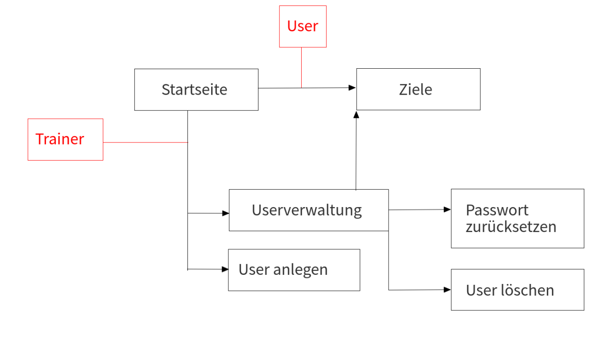
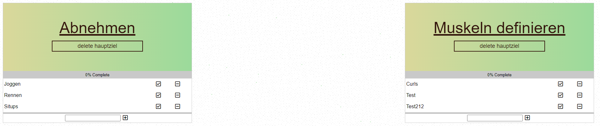

# Fitnesso 1.0

## Dokumentation:

**Table of Contents**

- [Entwurf eines Prototypen (Prototyp + Informationsarchitektur) aus den Personas und den User Storys](#Prototyp)
- [Kommentierung der Prototypen mit Gestaltgesetzen und Infos zu menschlichen Wahrnehmung](#Gestaltgesetze)
- [Kommentierung der Umsetzung des Prototypen mittels Entwurfsmuster](#Entwurfsmuster)
- [Erstellen ein Usability-Testkonzept für die Anwendung](#Usability-Testkonzept)

- [Framework](#framework)
- [Installation](#installation)
  * [Setup](#setup)
- [Unit-Tests](#unit-tests)
  * [Backend](#backend)
  * [Frontend](#frontend)
- [Wie funktioniert der Code?](#sourcecode)

# Prototyp

### Entwurf eines Prototypen (Prototyp + Informationsarchitektur) aus den Personas und den User Storys

## Prototype:

## Informationsarchitektur:

# Gestaltgesetze
### Kommentierung der Prototypen mit Gestaltgesetzen und Information zu menschlichen Wahrnehmung

Gestaltgesetz der Ähnlichkeit: Ziele sind immer gleich aufgebaut und haben die gleichen Funktionen

Gestaltgesetz der Ähnlichkeit: Alle input Felder sind gleich aufgebaut und funktionieren gleich.

Gestaltgesetze Symmetrie: Alle anzeigen auf der Website sind zentriert.

Gestaltgesetze gemeinsame Region: Ziele und Forms sind mit einem Kasten umrundet.

Fitts‘ Gesetz: Alle Knöpfe und Eingabefelder sind leicht zu treffen

# Entwurfsmuster
### Kommentierung der Umsetzung des Prototypen mittels Entwurfsmuster
s
Ein wichtiges Design Pattern ist der Decorator. Der Decorator ist ein Strukturmuster, welches einen ermöglicht, Objekten dynamisch neue Verhaltensweisen hinzuzufügen. 
In unserem Fall werden diese Decorator benutzt:

    @require_http_methods(["POST"])
    @transaction.atomic
    @validate_goal_user_rights

Der erste decorator limitiert Methoden auf bestimmte request Methoden, in diesem Fall darf die Methode nur mittels POST request aufgerufen werden.
Der zweite decorator gibt an, das alles in der Methode eine transaction ist, also wenn etwas schiefgeht wird die Datenbank auf den Ursprungszustand zurückgesetzt.
Der dritte decorator ist selber geschrieben, und wird für alle Aktionen der Ziele genutzt. 
Dort wird geprüft, ob der Antragsteller der Änderung entweder der Besitzer der Ziele ist oder ob es ein Trainer war.

# Usability-Testkonzept
### Erstellen ein Usability-Testkonzept für die Anwendung

### A/B-Tests

## Test 1

Beim Testen mit anderen Nutzern ist aufgefallen, dass das Erkennen der Fehler beim Registrieren zu lange dauert. Dabei wurde die Concurrent Think Aloud (CTA) verwendet: Nutzer haben nach dem sie den Button „Nutzer anlegen“ gedrückt haben, geflucht das es nicht funktioniert hat und sich gefragt, woran es liegt, weil es nicht offensichtlich war.
Aus diesem Grund wurde hier eine Variation mit roter Schrift erstellt. Beide Tests wurden mit 10 Personen durchgeführt, wovon 5 mit A und 5 mit B angefangen haben. 
Dabei hat sich herausgestellt, dass A im Durchschnitt eine Zeit von 51,3 Sekunden gedauert hat und B im Durchschnitt 44,9 Sekunden. Das bedeutet, B ist um 6,4 Sekunden (~13 %) schneller.

## Test 2

Auch hier ist erst beim Start der ersten Tests aufgefallen, das etwas fehlt. Eine Suchleiste. 
Sollten mal viele Nutzer existieren ist diese erforderlich. Ohne einen Test analysieren zu müssen, ist hier klar das B schneller ist. Wurde dennoch in der Entwicklung vergessen und ist erst bei den Usability-Tests aufgefallen.

# Dokumentation

## Framework:

Als Framework wird Django3 (3.13) verwendet.

### Warum Django?

Das Framework bringt standardmäßig eine SQLite Datenbank mit. Diese Datenbank lässt sich in Python erstellen (`API/models.py`) und das Framework kümmert sich um die Verwaltung / Übersetzung.
Bei einem Request wird der Python Code aufgerufen und die benötigten Daten aus der Datenbank geladen.

Dank Django lassen sich zusätzlich im HTML Code *schleifen* und *if* abfragen erstellen, was den Arbeitsaufwand um einiges reduziert.
So muss man nicht beim Laden der Seite noch zusätzlich die Daten via Javascript laden lassen. 

Beispiel if:

    
      You need to login
    

Beispiel Schleife:

    
      Ziel: {{ ziel.ziel }}
      Status: {{ ziel.status }}
    

Ansonsten wird normales Javascript und HTML verwendet und ist deshalb auch das Framework für dieses Projekt.

Zum Erstellen, Löschen (…) eines Ziels wird beispielsweise ein POST request (AJAX) an den Webserver gesendet. 

Alle Schnittstellen sind bei `Fitnesso/urls.py` zu finden.
Alle HTML Templates sind bei `API/templates/`
Javascript und CSS ist bei `static/js/` und `static/css/`.

Django Docs:
https://docs.djangoproject.com/en/3.1/

### Zusätzliche Abhängigkeiten: 

##### Fontawesome (https://fontawesome.com/):

Hier wurden die Vector Icons für die Webseite geholt. Wieso Vector? Vector Grafiken sind skalierbar, sehen auf jeder größe also gut aus.

##### JQuery (https://jquery.com/):

Dank JQuery lassen sich AJAX anfragen an den Webserver stellen und es lässt sich sehr einfach auf Elemente zugreifen: `$("#register-email").val()`
mit diesem kurzen Befehl bekommt man den Wert eines Input Feldes.

## Installation

Python 3.9 wurde in der Entwicklung verwendet, weswegen diese Version empfohlen wird.
Python 3.6 oder höher wird benötigt um diese Anwendung ausführen zu können.

Nachdem Python installiert wurde, können Sie die unten stehenden Befehle ausführen:

#### Setup

    pip install django -U
    
    python manage.py makemigrations API
    python manage.py migrate 

    python manage.py createsuperuser 
    

Run:

    python manage.py runserver localhost:8080

## Unit-Tests:

Unser Testkonzept sieht Backend und Frontend tests vor. 

#### Backend:

Um die Schnittstellen zu testen werden Daten benötigt. 
Aus diesem Grund wird eine Datenbank "gemockt", also eine temporäre Datenbank erstellt, welche Test Daten enthält und nur während des Tests verfügbar ist.

Jede Schnittstellen wird mit mindestens zwei Tests getestet. Ein Test, welcher falsche Daten sendet und damit ein ServerError hervorruft und einer, welcher richtige Daten sendet und somit schaut ob der HTTP Response Code 200 ist.

Die Tests sind zu finden bei: `API/tests.py`

#### Frontend:

Da die Schnittstellen bereits im Backend getestet werden, wird nur getestet, ob die Javascript Validation erfolgreich ist oder nicht.

Da hier nur dummy Werte eingesetzt werden, wird die antwort des Servers ignoriert.

Die tests sind zu finden bei: `static/js/tests.js`

URL: http://localhost:8000/tests/-1

Die -1 in der URL ist eine DummyID. Jeder User hat eine eindeutige positive ID. Somit lassen sich die Javascript tests durchführen,
ohne einen richtigen User zu nehmen.
